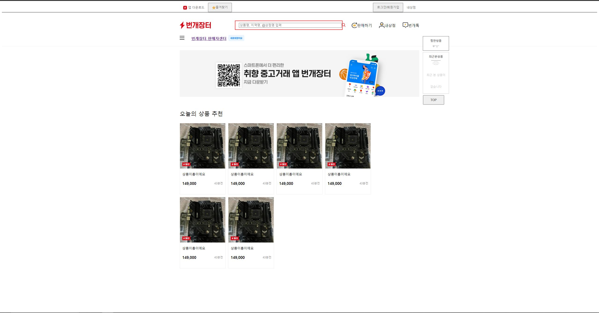

번개장터 클론코딩
=============

## html + css 

- 검사를 통해 전체 뼈대를 이루는 div, a태그 등을 분석
- 이후 ```<head>``` 부분에 ```<style>```태그를 이용하지 않고, 별도의 css 파일을 만들어 사용함

- 페이지 화면

</img><br/>


- 파일 설명
    - index.html : 웹페이지의 구조가 담긴 html 파일
    - bunjang.css : css요소가 담긴 파일
    - README.md : 마크다운


